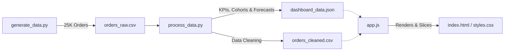

# 📊 ZippyBites: Food Delivery KPI Analysis & Forecasting Case Study

An end-to-end interactive dashboard and analytical case study investigating operational performance, customer cohorts, and financial metrics for a food delivery startup (ZippyBites) operating in 6 metro Indian cities.

This repository features a complete Python-to-Web dashboard pipeline showing how raw data translates into actionable logistics, retention, and growth strategies.

🌐 **Live Dashboard Demo**: *[Add your GitHub Pages URL here once hosted]*

---

## 🚀 Project Architecture & Pipeline



1. **Synthetic Data Engine (`generate_data.py`)**: Uses Python and NumPy to simulate 25,000+ realistic orders across Mumbai, Delhi, Bangalore, Hyderabad, Pune, and Chennai over 12 months. It models real-world patterns like weekend AOV drops, dinner-rush traffic bottlenecks, and driver unavailability.
2. **Analytics Engine (`process_data.py`)**: Handles datetimes, filters duplicate entries, computes core KPIs, performs month-over-month customer cohort retention analysis, and runs a linear regression model to forecast next-month revenues.
3. **Interactive UI (`index.html`, `styles.css`, `app.js`)**: A premium vanilla dark-mode dashboard that parses datasets on-the-fly inside the browser. Users can adjust dropdown slicers (City, Cuisine, Day Type) to dynamically update all metrics and charts in real-time.

> 📝 **Note on Data Limitations**: This dataset is synthetically generated using Python to mirror realistic food-delivery operational patterns (AOV distributions, traffic-driven delays, cohort churn) since real platform data is highly proprietary and not publicly available. All distributions are calibrated to be directionally consistent with industry-reported benchmarks from Zomato/Swiggy public reports.

---

## 📈 Key KPIs & Strategic Findings

### 1. Financial Trends
- **Total Revenue**: **₹86.13 Lakhs** generated across 25,000 placed orders.
- **AOV (Average Order Value)**: Stands at **₹369**. However, AOV falls to **₹298** on weekends compared to **₹396** on weekdays.
  - 💡 *Recommendation*: Introduce high-margin **Weekend Combo Bundles** (family-pack meals) on Saturdays and Sundays to push ticket size up.

### 2. Logistics & Operations SLA
- **Global On-Time Rate (SLA &le; 40 mins)**: **42.4%** (Average delivery duration is 44.6 mins).
- **Bangalore Logistics Bottleneck**: Bangalore lags behind with only a **30.1%** on-time delivery rate due to severe traffic gridlock.
  - 💡 *Recommendation*: Deploy high-density dark kitchens and transition short-range deliveries to bicycle fleets during peak hours.

### 3. Order Cancellations
- **Cancellation Rate**: **6.5%** overall.
- **Rider Availability**: **36%** of cancellations occur because delivery partners are "unavailable" during lunch and dinner spikes (8:00 PM – 10:00 PM).
  - 💡 *Recommendation*: Introduce **Peak-Hour Logistics Multipliers** (1.5x pay boost) to incentivize active riders during dinner rushes.

### 4. Cohort Retention Curve
- **First-Month Drop-off**: Customer retention decreases from **38%** in Month 1 to **14%** in Month 3.
  - 💡 *Recommendation*: Trigger automatic **Win-Back Campaigns** (₹100 discount codes) to customers crossing the 45-day post-registration window to flatten the early churn slope.

---

## 🔮 Predictive Forecast & Sandbox

- **Model**: Linear Regression (`y = mx + c`) fitted on 12 months of actual sales.
- **Growth Rate (Slope)**: **+₹7,597 / month** growth trajectory.
- **June 2026 Revenue Forecast**: Projected at **₹720,296**.
  - 📝 *Note on Model Limitations*: This is a baseline trend model on 12 months of data and does not account for complex seasonality (e.g., festival surges, monsoons) or marketing spend variables. A production-ready forecasting model would deploy **SARIMA** or **Prophet** to capture these periodic seasonality layers.
- **Interactive Sandbox**: The dashboard includes a fully implemented simulator card where stakeholders can adjust variables (e.g., AOV, cancellation rates, on-time rates) and immediately see the projected annual revenue impact.

---

## 🛠️ How to Run Locally

### 1. Clone this Repository
```bash
git clone https://github.com/YOUR_USERNAME/Food_Delivery_KPI_Analysis_CaseStudy.git
cd Food_Delivery_KPI_Analysis_CaseStudy
```

### 2. Generate and Process Data
Make sure you have `pandas` and `numpy` installed:
```bash
pip install pandas numpy
python generate_data.py
python process_data.py
```

### 3. Launch Local Server
Start a lightweight web server:
```bash
python -m http.server 8080
```
Open your web browser and navigate to **`http://localhost:8080`**.

---

## 🌐 Deploy to GitHub Pages
To host this interactive case study online for free:
1. Create a public repository on GitHub.
2. Commit and push the frontend files (`index.html`, `styles.css`, `app.js`, `orders_cleaned.csv`, `dashboard_data.json`).
3. Go to **Settings > Pages** on your GitHub repository.
4. Select the **main branch** as the build source and click **Save**.
5. Your dashboard will be live in 1-2 minutes!

---

## 🛠️ Future Technical Roadmap
To scale this case study into a production-grade enterprise application:
- **Database Integration**: Migrate from static CSV/JSON files to a structured database (like PostgreSQL or MongoDB) served via a backend REST API (FastAPI or Express.js). This allows query-level filtering on millions of rows instead of client-side CSV parsing.
- **Advanced Forecasting Engine**: Upgrade the current baseline linear trend model to a seasonal time-series forecasting model using **SARIMA** or **Facebook Prophet** to capture complex Indian seasonal factors (festive rushes, monsoon logistics delays, and cricket match demand peaks).
- **Rider Incentive Optimizer**: Deploy a machine learning reinforcement model to dynamically calculate the optimal surge pricing and peak-hour delivery incentives to minimize cancellation leakage.

